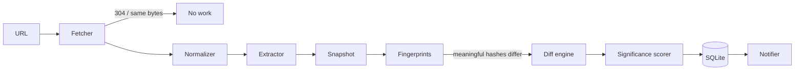

# SiteWatch

Monitor websites and detect meaningful changes — not HTML noise.

SiteWatch is a local-first, open-source CLI that extracts visible, structured page content and reports changes worth reading. It ignores scripts, hidden fields, tracking parameters, rolling timestamps, and other technical churn. The core is deterministic: no API key, hosted service, or AI model is required.

```console
$ sitewatch add https://stripe.com/pricing
✓ Monitor created
  ID: 1
  URL: https://stripe.com/pricing
  Check interval: 1h0m0s
  Initial snapshot created

$ sitewatch check 1
1 changes detected

1 meaningful changes

HIGH  0.96  ~ price — Pro
  - $20/month
  + $25/month
```

## Features

- One Go binary and one local SQLite database; no CGO required.
- Structured extraction of titles, headings, paragraphs, links, buttons, images, prices, metadata, OpenGraph, and JSON-LD.
- Separate fingerprints for raw HTML, visible text, headings, links, prices, and structured data.
- Deterministic structural diff and significance scores from 0 to 1.
- HTTP limits, retries, redirects, gzip, ETag, Last-Modified, and cancellation.
- SSRF protection blocks loopback, private, link-local, multicast, and metadata addresses, including redirect targets.
- Bounded same-site crawling with robots.txt, sitemap indexes, worker concurrency, URL deduplication, and per-host rate limiting.
- Historical snapshots, retention, JSON output, webhooks, scheduler, local HTTP API, and a small server-rendered dashboard.
- JavaScript shell detection. Chrome is not required; pages needing rendering produce a warning.

## Installation

Requires Go 1.27 or newer. The CI and container build use the current stable Go release.

```sh
git clone https://github.com/sitewatch/sitewatch.git
cd sitewatch
go build -o sitewatch ./cmd/sitewatch
./sitewatch version
```

On Windows, build with `go build -o sitewatch.exe ./cmd/sitewatch`.

## Quick start

```sh
sitewatch add https://example.com/pricing --name "Example Pricing" --interval 1h
sitewatch list
sitewatch check 1
sitewatch history 1
sitewatch diff 1
sitewatch watch
```

Site crawling stays on the original hostname and is always bounded:

```sh
sitewatch add https://example.com --crawl --depth 2 --max-pages 50 --rate 5
```

Discovered pages become ordinary independent monitors, so every page gets its own schedule, history, and diff. `robots.txt` is respected unless `--ignore-robots` is explicitly supplied. Direct requests to a user-specified page are allowed even when discovery rules disallow it.

Local development targets are blocked by default. Opt in deliberately:

```sh
sitewatch add http://127.0.0.1:8000 --allow-private
```

## CLI

| Command | Purpose |
| --- | --- |
| `sitewatch add <url>` | Create a monitor and its initial snapshot |
| `sitewatch list [--json]` | List monitors |
| `sitewatch remove <id>` | Remove a monitor and its history |
| `sitewatch check <id-or-url>` | Run a check immediately |
| `sitewatch history <id-or-url> [--json]` | Show retained snapshots |
| `sitewatch diff <id-or-url> [--all] [--min-score N] [--json]` | Show the latest structured changes |
| `sitewatch show <id>` | Show monitor configuration as JSON |
| `sitewatch watch` | Run all due monitors until interrupted |
| `sitewatch serve [--addr 127.0.0.1:8080]` | Run the local API and dashboard |
| `sitewatch config` | Print effective configuration |
| `sitewatch version` | Print the version |

`add` also accepts `--name`, `--interval`, `--crawl`, `--depth`, `--max-pages`, `--retention`, `--webhook`, and `--allow-private`. The minimum interval is one minute.

## How it works



The raw HTML hash is an optimization, not the decision. If HTML changes while visible and structured fingerprints remain equal, SiteWatch records a successful check but does not create a duplicate snapshot or report a change.

Initial significance weights are intentionally plain and testable:

- price modified/removed: `0.96` / `0.95`
- product or structured item added/removed: `0.90`
- heading added/removed: `0.82`
- title: `0.60`
- link: `0.45`
- paragraph: `0.35`

The default output threshold is `0.40`. Use `diff --all` to inspect lower-scored content changes.

## Storage

SQLite uses three indexed tables: `monitors`, `snapshots`, and `changes`. A snapshot stores the structured JSON and fingerprints rather than retaining full HTML. ETag and Last-Modified validators live on the monitor. The default retention is the latest 30 snapshots per monitor and can be changed with `--retention`.

The default database is in the platform user config directory:

- Linux: `~/.config/sitewatch/sitewatch.db`
- macOS: `~/Library/Application Support/sitewatch/sitewatch.db`
- Windows: `%AppData%\sitewatch\sitewatch.db`

## Configuration

SiteWatch reads `sitewatch/config.yaml` from the platform user config directory. Precedence is flags, environment, YAML, then defaults.

```yaml
db: /var/lib/sitewatch/sitewatch.db
user_agent: SiteWatch/0.1
timeout: 15s
max_body: 10485760
retries: 2
concurrency: 10
rate: 5
min_score: 0.4
allow_private: false
verbose: false
```

Environment variables include `SITEWATCH_DB`, `SITEWATCH_USER_AGENT`, `SITEWATCH_TIMEOUT`, `SITEWATCH_CONCURRENCY`, `SITEWATCH_ALLOW_PRIVATE`, and `SITEWATCH_VERBOSE`.

## JSON and webhooks

`list`, `history`, and `diff` support `--json`. A monitor created with `--webhook URL` sends a POST only when changes meet the configured threshold:

```json
{
  "monitor": "Example Pricing",
  "url": "https://example.com/pricing",
  "changes": [{"type":"modified","entity":"price","score":0.96}],
  "timestamp": "2026-08-29T12:00:00Z"
}
```

Webhook destinations receive the same SSRF protection as monitored URLs.

## HTTP API and dashboard

Run `sitewatch serve`. It binds to `127.0.0.1:8080` by default and serves the dashboard at `/`.

- `GET /health`
- `GET|POST /api/monitors`
- `GET|DELETE /api/monitors/{id}`
- `POST /api/monitors/{id}/check`
- `GET /api/monitors/{id}/history`
- `GET /api/monitors/{id}/changes`

There is intentionally no built-in authentication. Keep the default loopback bind or put an externally exposed instance behind authentication and TLS.

## Docker

```sh
docker build -t sitewatch .
docker run --rm -v "$(pwd)/data:/data" sitewatch watch
```

Or run `docker compose up --build`. The database persists at `/data/sitewatch.db`.

## Demo

The demo has two pricing-page versions and needs no Internet access:

```sh
go run ./examples/demo-site --version v1
sitewatch add http://127.0.0.1:8000 --allow-private
# Restart the demo with --version v2, then:
sitewatch check 1
sitewatch diff 1
```

The only meaningful result is the Pro price changing from `$20/month` to `$25/month`; the bundle name, CSRF value, and timestamp are ignored.

## Development

```sh
make test
make race
make bench
make lint
make build
```

Tests use local fixtures and `httptest.Server`; they never depend on external websites. See [docs/architecture.md](docs/architecture.md) for package responsibilities and design boundaries.

## Security

Only `http` and `https` URLs are accepted. DNS results are validated before dialing, and the client connects to the validated address. Redirects are checked again. Private access requires the explicit `--allow-private` flag. Response bodies default to 10 MB, requests time out after 15 seconds, redirects stop after 10 hops, crawls have page/depth limits, and scheduler work is bounded.

Please report vulnerabilities privately to the maintainers rather than opening a public exploit issue.

## Roadmap

Potential additions—not current dependencies—include optional Chrome rendering, Slack/Discord/email/RSS notifications, screenshot diffs, embeddings and AI summaries, multi-user service mode, PostgreSQL, and distributed workers. See [TODO.md](TODO.md).

## License

MIT © SiteWatch contributors. See [LICENSE](LICENSE).
